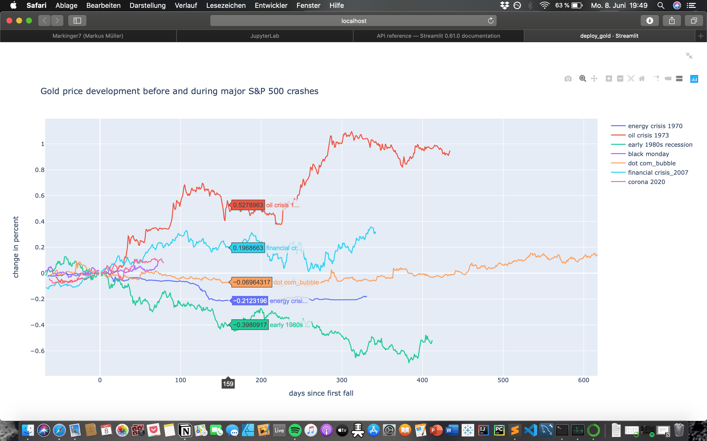

# Gold-development-during-major-S&P500-crashes
##### by Markus Müller
Visualization of the development of the gold price before and during major crashes.

### Motivation
The inspiration for this analysis is this <a href='https://www.reddit.com/r/dataisbeautiful/comments/fjvtt5/oc_current_market_sell_off_compared_to_major_ones/'> reddit post</a>, where the current crash is compared to major ones in the past.

Gold is generally known as the safe haven for investors in such crises and is therefore the profiteur of uncertain times. <b>But is this really the case?</b>

### Data
- Gold prices are from `quandle`
- S&P 500 prices from `yahoofinancials`

### Visualization with matplotlib and seaborn 

### Deloyed in a web app with streamlit and plotly

### How to run web app
run the following command in the terminal
1. set working dict:
`$ cd ~/Gold_development_during_crises`
2. activate environment with the relevnat libaries:
`$ conda activate base`
3. run deploy_gold.py:
`$ streamlit run deploy_gold.py`
4. the website with the app will open automatically:

### Python Libraries
- pandas
- numpy
- matplotlib
- seavorn 
- plotly
- yahoofinancials
- quandle
- streamlit
