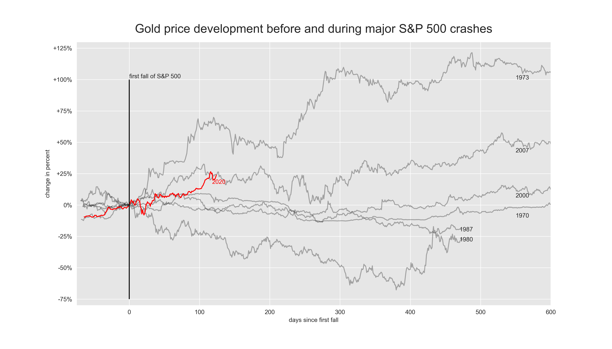

# Gold-development-during-major-S&P500-crashes (WIP)
##### by Markus Müller
Visualization of the development of the gold price before and during major crashes.

<a href="https://markusmueller-ds.github.io/portfolio/gold.html">Link</a> to website with more informations.

### Motivation
The inspiration for this analysis is this <a href='https://www.reddit.com/r/dataisbeautiful/comments/fjvtt5/oc_current_market_sell_off_compared_to_major_ones/'> reddit post</a>, where the current crash is compared to major ones in the past.

Gold is generally known as the safe haven for investors in such crises and is therefore the profiteur of uncertain times. <b>But is this really the case?</b>

### Data
- Gold prices are from `quandle`
- S&P 500 prices from `yahoofinancials`

### Visualization with matplotlib and seaborn 

### Conslusions (WIP)
- Only in two instances gold performed weaker than  the S&P 500 (early 1980s recession and Black Monday)
- The highest gain was after the oil crisis in 1973 with a max gain of 284%
- The biggest decrease in gold value during a crisis was -68% during the early 1980s recessions

### Libaries
- Numpy
- Pandas
- Matplotlib
- Seaborn
- (Plotly)
- (Streamlit)

### Resources
- https://www.quandl.com/data/LBMA-London-Bullion-Market-Association
- https://finance.yahoo.com/quote/%5EGSPC/
- https://stackoverflow.com/questions/35090498/how-to-calculate-percent-change-compared-to-the-beginning-value-using-pandas
- https://stackoverflow.com/questions/151199/how-to-calculate-number-of-days-between-two-given-dates
- https://www.programiz.com/python-programming/nested-dictionary
- https://stackoverflow.com/questions/18648626/for-loop-with-two-variables

### To Do
- finalize findings
- make chart more readble (bigger fontsize for the year)
- make chart interactive with plotly 
- write a Medium article based on this analysis

## Outdated information

### Deloyed in a web app with streamlit and plotly (outdated visualization)

### How to run web app
run the following commands in the terminal
1. set working dict:
`$ cd ~/Gold_development_during_crises`
2. activate environment with the relevnat libaries (I use conda, so for conda it is):
`$ conda activate base`
3. run deploy_gold.py:
`$ streamlit run deploy_gold.py`
4. the website with the app will open automatically

